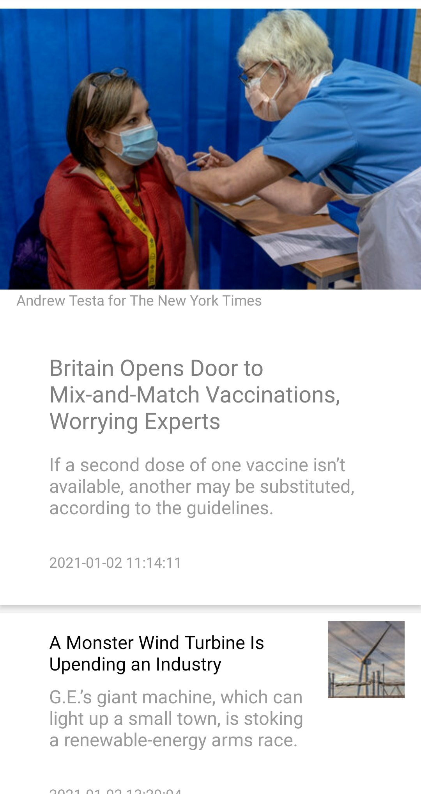
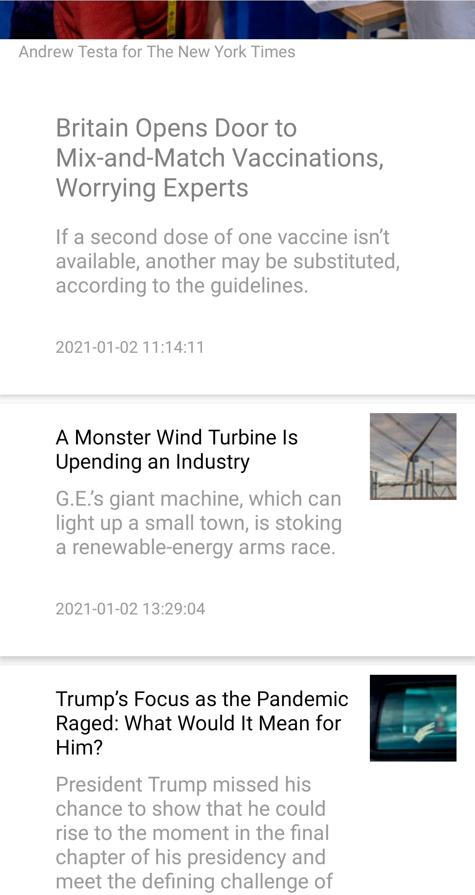
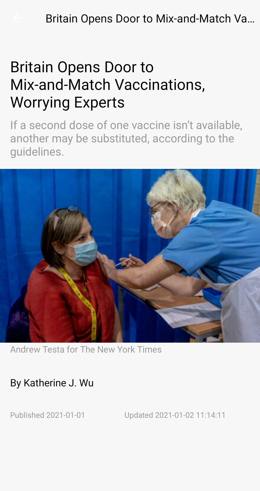
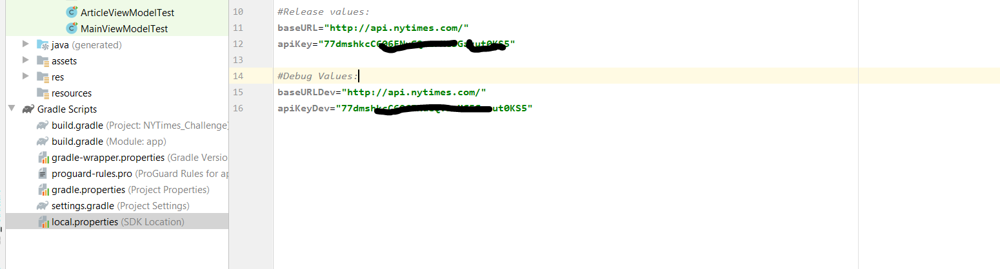

# Mobile-Challenge

A simple app to hit the NY Times Most Popular Articles.

## Screens

<b>Main article list Screen</b>



&nbsp;
&nbsp;
&nbsp;


<b>Main article list Screen</b>



&nbsp;
&nbsp;
&nbsp;

<b>Details View Screen</b>



&nbsp;
&nbsp;
&nbsp;

<b>Details View Screen</b>

&nbsp;
&nbsp;
#### The app has following packages:
1. **adapters** It Contains Binding Adapters
2. **callbacks** It Contains callback interfaces
3. **data**: It contains all the data accessing and manipulating components.
4. **dagger**: Dependency providing classes using Dagger2.
5. **ui**: View classes along with their corresponding ViewModel.
6. **utils**: Utility classes.

&nbsp;

# Installation
* Cloning the repository.

* #### Add the below lines to local.properties file in order to run the project correctly.
#in our case the base url and api key for both development and live versions are the same.

&nbsp;

* replace <add your api key> with your own api key.
You'll be using the most viewed section of this API. Note: you need to sign up for an API key at:
https://developer.nytimes.com/get-started,

```gradle
#Release values:
flickrBaseURL="http://api.nytimes.com/"
flickrApiKey="<add your api key>"
  
#Debug Values:
flickrBaseURLDev="http://api.nytimes.com/"
flickrApiKeyDev="<add your api key>"
```
* Build your project
* Run app or the test files


